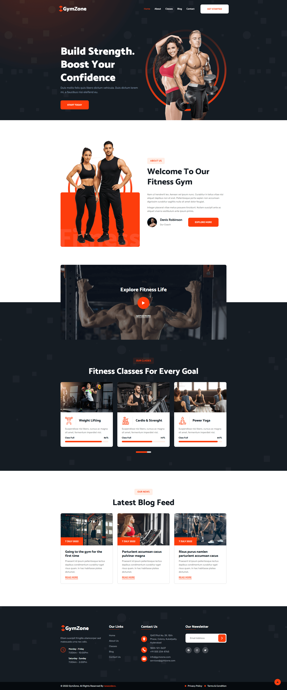

<div>
  <h1>GymZone – Modern Fitness & Gym Website</h1>

  <p>
    A professional fitness gym landing page template, <br />
    built using HTML, CSS, and JavaScript. Fully responsive design for all devices.
  </p>

  <p>
    <strong>Note:</strong> I started building HTML, CSS, and JavaScript projects in 2022. <br />
    At that time, I focused on learning first and began uploading to GitHub recently. <br />
    Now I'm working with React.js and Next.js, and seeking opportunities as a frontend or web developer.
  </p>
</div>

## What's Inside
- `index.html` — complete website structure with semantic markup
- `assets/css/style.css` — comprehensive styling with `:root` CSS variables for easy customization
- `assets/js/script.js` — mobile navigation toggle, scroll-based header animations, and back-to-top functionality
- `assets/images/` — hero banners, class photos, blog images, coach avatars, decorative elements, and UI icons

## Technologies Used
HTML5 · CSS3 · Vanilla JavaScript · Google Fonts (Catamaran, Rubik) · Ionicons

## Features
- Fully responsive layout across mobile, tablet, and desktop screens
- Animated header with scroll-triggered visibility
- Mobile navigation menu with smooth toggle functionality
- Hero section with animated floating elements
- Fitness classes showcase with progress indicators
- Video section with interactive play button
- Blog articles display with hover effects
- Newsletter subscription form with icon integration

## Quick Start
1. **Clone the repository:**  
   ```bash
   git clone https://github.com/nawazdevx/gym-zone.git
   ```

2. **Open the project:**  
   - Simply open `index.html` in your browser  
   - Or run a local server:  
     ```bash
     python -m http.server 3000
     ```
     Then visit `http://localhost:3000`

## Customization
- Update text content and meta descriptions in `index.html` to match your gym's information
- Replace images in `assets/images/` folder (maintain consistent dimensions for best results)
- Modify color scheme using `:root` CSS variables at the beginning of `style.css`
- Adjust section layouts and spacing with well-organized, commented code structure
- Integrate the newsletter form with email services like Mailchimp, Formspree, or custom backend solutions

## License
This project is licensed under the [MIT License](https://choosealicense.com/licenses/mit/).

## Contact
If you want to contact me, you can reach me at [LinkedIn](https://www.linkedin.com/in/nawazdevx).

## Support
If you find this project useful, please consider starring it on GitHub ⭐ to show your support!

<br />

<div align="center">
  <h1>Project Preview</h1>
  
  <p>
    You can view the live project here ➜
    <a href="https://nawazdevx.github.io/gym-zone/" target="_blank"><strong>Live Demo</strong></a>
  </p>

  
</div>