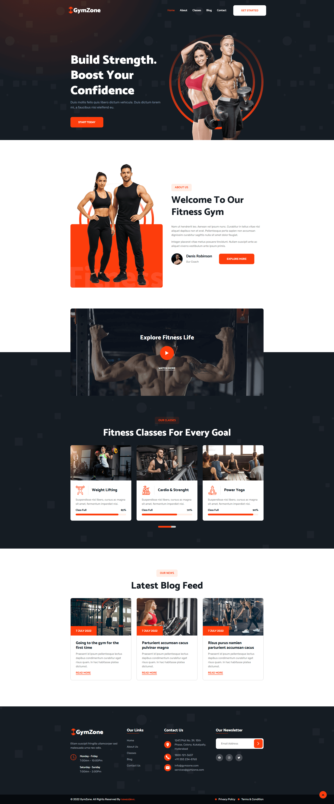

  <h1>GymZone – Fitness Website</h1>

  

    <strong>About the Project:</strong>
    GymZone is a modern, fully responsive gym and fitness website built with HTML, CSS, and JavaScript. It showcases fitness classes, trainer profiles, blog posts, and contact details — designed to represent a professional gym brand online.
  

  

    <strong>Key Highlights:</strong>
    Clean layout with smooth animations, mobile-first responsive design, interactive navigation, and a polished UI that works across all screen sizes.
  

  
<h2>Project Details</h2>

  

    
<h4>What's Inside</h4>

    <ul>
      <li><strong>Header & Navigation</strong> — Sticky header with responsive mobile menu toggle</li>
      <li><strong>Hero Section</strong> — Full-screen banner with headline, text, and CTA button</li>
      <li><strong>About Section</strong> — Gym intro with trainer profile and animated banner image</li>
      <li><strong>Video Section</strong> — Promotional video card with animated play button</li>
      <li><strong>Classes Section</strong> — Scrollable fitness class cards with progress indicators</li>
      <li><strong>Blog Section</strong> — Latest news cards with date badges and read more links</li>
      <li><strong>Footer</strong> — Brand info, navigation links, contact details, and newsletter form</li>
      <li><strong>Back to Top Button</strong> — Smooth scroll button that appears on page scroll</li>
    </ul>
  

  

    
<h4>Key Features</h4>

    <ul>
      <li><strong>Responsive Design</strong> — Fully optimized layout for mobile, tablet, and desktop</li>
      <li><strong>Sticky Header</strong> — Header changes style dynamically when the user scrolls</li>
      <li><strong>Mobile Navigation</strong> — Hamburger menu toggles full-screen overlay on mobile</li>
      <li><strong>CSS Animations</strong> — Rotating circles, floating images, and pulsing play button</li>
      <li><strong>Horizontal Scrollbar</strong> — Smooth snap scrolling for class and blog card lists</li>
      <li><strong>Progress Bars</strong> — Visual class capacity indicators inside each class card</li>
      <li><strong>Back to Top</strong> — Scroll-triggered button for quick return to the top of the page</li>
    </ul>
  

  

    
<h4>Technologies Used</h4>

    <ul>
      <li><strong>HTML5</strong> — Semantic markup used to structure all page sections cleanly</li>
      <li><strong>CSS3</strong> — Custom properties, animations, flexbox, and grid for layout</li>
      <li><strong>JavaScript (ES6)</strong> — Handles nav toggle, header scroll, and back-to-top logic</li>
      <li><strong>Google Fonts</strong> — Catamaran and Rubik fonts for consistent modern typography</li>
      <li><strong>Ionicons</strong> — Icon library used for UI icons throughout the website</li>
    </ul>
  

  

    
<h4>Project Structure</h4>

    <pre>
gym-zone/
│
├── index.html                 # Main HTML structure with all sections
│
├── assets/
│   ├── css/
│   │   └── style.css          # Complete styles, animations, and responsive design
│   │
│   ├── js/
│   │   └── script.js          # Navigation toggle, header scroll, back-to-top functionality
│   │
│   └── images/                # Hero banners, class images, blog photos, and icons
│
└── README.md                  # Project documentation
    </pre>
  

  

    
<h4>Quick Start</h4>

    <ol>
      <li>
        <strong>Clone the repository:</strong>
        <pre><code>git clone https://github.com/nawazdevx/gym-zone.git</code></pre>
      </li>

      <li>
        <strong>Open the project:</strong>
        <ul>
          <li>Open <code>index.html</code> directly in your browser</li>
          <li>Or run a local server:</li>
        </ul>
        <pre><code>python -m http.server 3000</code></pre>
        Then visit <code>http://localhost:3000</code>
      </li>

      <li>
        <strong>Start Customizing:</strong>
        <ul>
          <li>Update gym name, tagline, and hero text in <code>index.html</code></li>
          <li>Replace class images and blog photos inside <code>assets/images/</code></li>
          <li>Edit class names, descriptions, and progress values in <code>index.html</code></li>
          <li>Change colors and fonts using CSS variables in <code>style.css</code></li>
          <li>Update contact details, social links, and footer info in <code>index.html</code></li>
        </ul>
      </li>
    </ol>

  

  <strong>License:</strong>
  This project is licensed under the <a href="https://choosealicense.com/licenses/mit/">MIT License</a>.

  <strong>Contact:</strong>
  Connect with me on <a href="https://www.linkedin.com/in/nawazdevx">LinkedIn</a> or visit my <a href="https://nawazdevx.vercel.app/">Portfolio</a>.

  <strong>Support:</strong>
  Found this helpful? Give it a ⭐ on GitHub! Thank you.

 

  <h2>Project Preview</h2>

  

    <strong>Live project ➜</strong>
    <a href="https://nawazdevx.github.io/gym-zone/" target="_blank">
      <strong>Live Demo</strong>
    </a>
  

  

